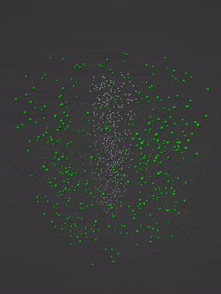

# Blender Neuron Ion and Magnetic Field Simulation

## Overview

This Blender script performs a simulated animation of Sodium and Potassium ions along a neural axon. Additionally, it includes magnetic spheres that rotate around the axon, mimicking a magnetic field. The aim is to visualize the complex interactions between ions and magnetic fields during a neural spike.

### Key Features

- Generates a 3D cylinder representing the neural axon.
- Creates Sodium and Potassium ions inside the axon.
- Simulates magnetic spheres outside the axon to represent the magnetic field.
- Animate ions and magnetic spheres based on a Gaussian spike function.
- Materials are assigned to ions and magnetic spheres for better visualization.

### How it Works

1. **Environment Cleanup**: Deletes existing mesh objects in the scene.
2. **Axon Creation**: Adds a cylinder to serve as the neural axon.
3. **Ion Population**: Randomly places Sodium and Potassium ions within the axon.
4. **Magnetic Field Representation**: Randomly places spheres at varying distances from the axon to act as magnetic particles.
5. **Material Assignment**: Differentiates Sodium, Potassium, and magnetic spheres by color.
6. **Animation**: 
    - Moves ions based on a Gaussian spike function.
    - Rotates magnetic spheres around the axon. The rotation speed is inversely proportional to their radial distance from the axon, and also varies based on the spike intensity.
    - Scales the axon based on the spike intensity.

### Dependencies

- Blender
- Python

Feel free to dive into the source code for a more detailed understanding. Enjoy exploring this visual representation of ion behavior and magnetic fields in neurons!

